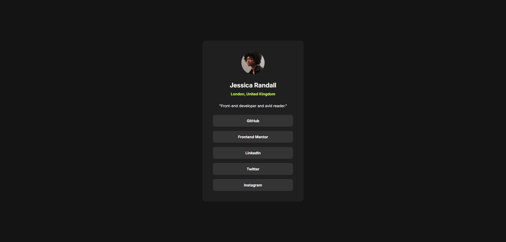

<h1 align="center">Social links profile</h1>

Solution to the Frontend Mentor challenge

  

This is a solution to the [Social links profile challenge on Frontend Mentor](https://www.frontendmentor.io/challenges/social-links-profile-UG32l9m6dQ). Frontend Mentor challenges help you improve your coding skills by building realistic projects.

## Screenshot

Desktop view (1920px wide)

## Features

Users should be able to:
- See hover and focus states for all interactive elements on the page

## Built with

- HTML
- CSS

## Links

- Solution URL: https://example.com
- Live Site URL: https://example.com

## Author

find me on other platforms!

- Frontend Mentor: [@AverageBaguetteEnjoyer](https://www.frontendmentor.io/profile/AverageBaguetteEnjoyer)
- CodeWars: [AverageBaguetteEnjoyer](https://www.codewars.com/users/AverageBaguetteEnjoyer)
- Coddy: [@baguetteenjoyer](https://coddy.tech/user/baguetteenjoyer?via=share_profile)